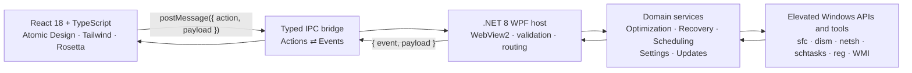
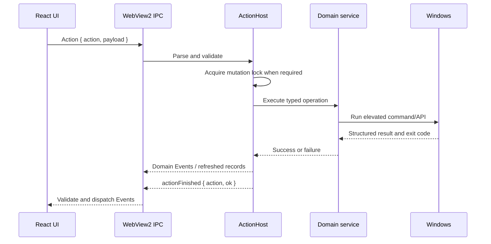

# VeloSys Pro — Architecture

VeloSys Pro is a single, self-contained Windows desktop executable that pairs a **React 18 +
TypeScript** user interface with a **C# .NET 8 WPF** host through **Microsoft Edge WebView2**. The
UI is compiled by Vite and embedded into the assembly as resources, so the shipped `VeloSysPro.exe`
carries its own front end with no external `ui/` folder.

This document describes how the two halves communicate, how ownership is divided, and the invariants
that keep an elevated, bilingual optimizer safe and testable. Domain vocabulary is defined in
[`CONTEXT.md`](CONTEXT.md); the load-bearing decisions are recorded as ADRs — the IPC seam in
[0001](docs/adr/0001-use-webview2-event-envelopes.md) and
[0002](docs/adr/0002-use-structured-validated-actions.md), and the Tweak framework in
[0003](docs/adr/0003-tweak-as-reversible-unit.md)–[0007](docs/adr/0007-jsonl-snapshot-store.md).

---

## 1. High-level shape

The executable always runs elevated (`requireAdministrator`, see `desktop/app.manifest`) because the
optimizations invoke privileged system tools.

---

## 2. IPC model — Actions in, Events out

The React↔host boundary is deliberately asymmetric and named after intent (`CONTEXT.md`):

| Direction | Name | Shape | Transport |
| :-- | :-- | :-- | :-- |
| UI → host | **Action** | `{ action, payload }` | `window.chrome.webview.postMessage` |
| host → UI | **Event** | `{ event, payload }` | `PostWebMessageAsJson`, one `message` listener |

- **Actions** are *intentions* the UI asks the host to perform or answer. Payloads are **structured
  and validated at the host seam** (ADR 0002), not strings validated per-module.
- **Events** are *facts* the host emits for the UI to observe. A single native channel concentrates
  serialization and validation (ADR 0001), replacing the old per-callback `window.onX` globals.

Because the UI and host ship as one executable, both stacks migrate together — there is no legacy
string-payload compatibility to maintain.

### Canonical Event names (`desktop/Ipc/IpcEvents.cs`)

`logReceived` · `statusUpdated` · `progressUpdated` · `backupsLoaded` · `tasksLoaded` ·
`restorePointsLoaded` · `settingsLoaded` · `updateAvailable` · `actionFinished` · `tweaksLoaded` ·
`snapshotCaptured` · `historyLoaded` · `debloatLoaded` · `debloatCompleted`

---

## 3. Backend (C# `desktop/`)

### The Action seam — `ActionHost`

`desktop/Ipc/ActionHost.cs` owns everything that happens between a parsed inbound message and an authoritative
completion:

- **Routing** — a `Dictionary<string, Func<JsonElement, bool>>` maps each `SystemActions` name to a
  typed handler; unknown Actions throw and finish `ok: false`.
- **Validation** — payloads are read through `ReadString` / `ReadInt` / `ReadObject<T>` at this one
  seam, so a malformed Action is diagnosed, not passed downstream.
- **Mutation exclusion** — mutating Actions are gated by an `Interlocked` flag: **one mutation at a
  time**, while reads stay concurrent (ADR 0002). An overlapping mutation is rejected with
  `ok: false` and never touches the system.
- **Refresh-after-success** — `MutateAndRefresh` runs the mutation and then re-emits the affected
  **Management Records** (e.g. a new backup → `backupsLoaded`). Failed mutations do **not** refresh.
- **Authoritative completion** — every Action, success or failure, ends by emitting
  `actionFinished { action, ok }`. This — not a progress value — is what releases the UI lock.

`IpcHandler` parses inbound Actions; `IpcEventEmitter` serializes each fact into the
`{ event, payload }` envelope (camelCase) through a transport delegate that the WPF host wires to
WebView2 and that tests capture directly.

### Domain services (deep modules)

| Module | Responsibility |
| :-- | :-- |
| `Optimizer` | Runs the named **Optimization Plans** — `Quick`, `Full`, `Revert` — plus `ClearUpdateCache`, `CleanPrefetch`, `ReportDiskHealth`. These are **maintenance**: cleanup and repair, owning no Tweaks. Success is derived from **exit codes**, not stderr presence. Honors the safety-backup preference. |
| `TweakCatalog` + `ITweak` | The **Tweak** catalog: one registry, BCD, service, or power-plan optimization each, able to `Detect`, `Capture`, `Apply`, and `Revert` itself, and declaring whether it `RequiresReboot`. **Presets** are Tweak-id sets over it, keyed by the CLI task names, and may reference `Safe` Tweaks only; **Recommended** additionally excludes anything needing a restart (ADR [0003](docs/adr/0003-tweak-as-reversible-unit.md), [0005](docs/adr/0005-advanced-risk-tier.md)). |
| `TweakEngine` | Orchestrates a batch: **Safety Checkpoint**, per-Tweak capture, then apply **and revert together under that one checkpoint** (reverts first), and the before/after measurement (ADR [0004](docs/adr/0004-safety-checkpoint.md)). Reports which settings actually moved, read back off the live system. Returns facts; `ActionHost` publishes them. `ApplyPreset` is the headless CLI's entry point. |
| `DebloatCatalog` + `DebloatManager` | Curated, **allow-listed** removal of preinstalled apps — explicitly *not* Tweaks, because an uninstalled app can only be reinstalled from the Store, by the user. The catalog names each entry by an id of the app's own making and keeps the real Appx family names to itself, so **no string the frontend sends can reach a removal command**. A batch runs behind the same Safety Checkpoint, and each entry's outcome is **read back off the machine** rather than taken from an exit code. |
| `SafetyCheckpoint` | The restore point a batch of system changes runs behind, and the single decision on whether the batch may proceed without one. Shared by `TweakEngine` and `DebloatManager` so the safeguard cannot exist on only one of the paths that need it. |
| `SnapshotManager` + `ISnapshotStore` | Captures an **Optimization Snapshot** from built-in facilities only (CIM, `Get-Service`, the Diagnostics-Performance log) and appends it to the append-only JSONL **Optimization History** (ADR [0006](docs/adr/0006-built-in-only-boundary.md), [0007](docs/adr/0007-jsonl-snapshot-store.md)). |
| `RegistryBackupManager` | Exports/imports TCP/IP registry `.reg` backups and lists them as Management Records; also exports/imports arbitrary keys as a Tweak's capture archive. |
| `SystemRestoreManager` | Lists, creates, and rolls back Windows System Restore points (rollback reboots). |
| `SchedulerManager` + `SchedulePolicy` | Create/list/delete Task Scheduler entries that run the exe headlessly. `SchedulePolicy` owns schedule validation, normalization, task-name encoding/decoding, and **locale-neutral** fallback states (`Unknown`). |
| `SettingsManager` | Persists preferences in `%LOCALAPPDATA%\VeloSysPro\settings.json`. |
| `UpdateChecker` | Compares the assembly version to the latest GitHub release. |

### Infrastructure

- `CommandRunner` / `ICommandRunner` — executes native tools, capturing stdout/stderr **decoded with
  the system OEM code page** (`NativeConsoleEncoding`, e.g. CP850) so localized output is not
  mojibaked, and returning exit codes. The interface lets tests substitute in-memory fakes.
- `IStatusSink` / `FileStatusSink` — the log/status/progress sink. In-app it feeds Events; in
  **headless CLI mode** (`VeloSysPro.exe --task=<quick|full|gaming|revert>`, used by the scheduler)
  it writes to a file. Preset ids and Optimization Plan names share that one `--task=` namespace:
  `gaming` resolves to the **Preset**, the rest to Plans, and a test forbids a Preset from
  shadowing a Plan.
- **CLI Boundary & Headless Flags** — `VeloSysPro.exe --version` (`-v`) and `--help` (`-h`) print
  version/usage information to stdout and exit headlessly with code 0 without initializing the WPF
  window or WebView2.
- **WebView2 Auto-Detection & Fallback Overlay** — If the Microsoft Edge WebView2 runtime is absent
  or broken, the WPF shell catches `WebView2NotInstalledException`, suppresses black screens, and
  displays a fallback overlay offering automatic, silent installation of `MicrosoftEdgeWebview2Setup.exe`.
- `ManagedStream` + `MainWindow` — serve the embedded `ui/` bundle from memory via WebView2
  `WebResourceRequested` under `https://velosys.app/`, so the release needs no `ui/` folder on disk.
- `AppPaths` — centralizes all mutable runtime data under `%LOCALAPPDATA%\VeloSysPro`: preferences,
  logs, Registry backups, per-Tweak captures, the Optimization History (`history.jsonl`), and the
  WebView2 user-data profile. The executable directory stays clean.

---

## 4. Frontend (React `frontend/src/`)

### The IPC seam — `bridge.ts` + Zod schemas

`frontend/src/infrastructure/bridge.ts` is the single module that talks to the host. It:

- sends Actions via `sendAction(action, payload?)`;
- registers **one** `message` listener, parses each `{ event, payload }` envelope, and dispatches to
  per-event subscribers;
- **runtime-validates every inbound payload** against Zod schemas before handing it to state.

`frontend/src/domain/schemas.ts` defines those schemas once and `domain/types.ts` re-exports the inferred
types, so the runtime check and the compile-time type can never disagree. An invalid Event is logged
and ignored — it never blanks the screen.

### State ownership (hooks)

React state is split into three focused owners instead of one mega-component:

| Hook | Owns |
| :-- | :-- |
| `useExecutionLifecycle` | The execution lock, mirroring the host: `runMutation` acquires it and only the matching `actionFinished` Event releases it; `runRead` never locks; progress is visual-only. |
| `useOsBackedLists` | The **Management Records** (backups, tasks, restore points), the Tweak catalog, and the Debloat list. Refreshes on relevant navigation and after successful mutations; a failed read **keeps the last valid list** rather than blanking it. |
| `usePreferences` | Settings. Updates are optimistic, but the host re-emits the persisted settings after acceptance or rejection, which wins. |

### UI conventions

- **Atomic Design** (`atoms → molecules → organisms → templates → pages`) with TypeScript prop
  interfaces.
- **Desired state, not queued commands.** The Optimize screen's checkboxes start mirroring what the
  host reports and the action bar submits the *difference*, so one batch can both apply and revert
  under a single Safety Checkpoint. A host re-emit always wins over the drawn intent, and anything
  that undoes an applied Tweak passes a `ConfirmDialog` naming exactly what will be undone.
- **Removal is not a desired state.** The Debloat screen is the deliberate exception to the rule
  above: a tick there means "uninstall this", nothing starts ticked (Optional least of all), and a
  `ConfirmDialog` names every selected app and how it would have to come back. Nothing on that
  screen calls a removal reversible, because this app cannot reverse one.
- **Tailwind design tokens only** — no inline hex/colors.
- **i18n** via Rosetta with nested keys mirrored in `pt_BR.json` / `en_US.json`. Host log/status
  messages travel as **i18n keys + args** and are translated in React, so the live console follows
  the selected language.

---

## 5. Packaging, Testing & Delivery

- **Single executable** — `build.ps1` builds the Vite bundle into `frontend/ui/`, embeds it as assembly resources, and
  publishes a self-contained, single-file `VeloSysPro.exe` (native WebView2 loader self-extracts).
- **Installer** — `installer/VeloSysPro.iss` (Inno Setup) installs the exe, adds shortcuts, and
  bootstraps the Evergreen **WebView2 Runtime** when missing.
- **3-Tier Testing Pyramid**:
  1. *Unit & Mock Level*: Vitest component tests and xUnit backend tests using in-memory `ICommandRunner` and `ITweakCaptureStore` fakes.
  2. *Live Native OS Integration*: xUnit tests under `desktop.Tests/Integration` testing real process boundaries, temporary registry keys under `HKCU\Software\VeloSysProTestSandboxTemp`, and OEM console encoding.
  3. *Zero-Pollution Windows Sandbox VM*: `scripts/test-sandbox.ps1` publishes a standalone executable, stages it to `$env:TEMP`, and runs it inside a disposable Hyper-V container.
- **Releases** — Conventional Commits (`type(scope): …`, enforced by commitlint) drive
  **semantic-release** on every push to `main`: it derives the version, runs `sync-version.mjs`
  across all version files, builds the installer, updates `CHANGELOG.md`, and publishes a GitHub
  Release. Pre-1.0, breaking → minor, feat/fix → patch.
- **CI** — GitHub Actions runs frontend validation, Docusaurus website build, Cypress E2E, .NET unit tests, live Windows OS integration tests, and standalone single-file executable smoke tests on every PR.

---

## 6. Cross-cutting invariants

- **Change both stacks together.** Any change to an Action/Event contract, payload, or i18n key must
  update the C# emitters/handlers, the TypeScript schemas/handlers, and both validation stacks in the
  same change.
- **Validate at the seam.** Host payloads are validated in `ActionHost`; frontend Event payloads are
  validated in `bridge.ts` before replacing state.
- **Serialize mutations, keep reads concurrent.** Elevated-operation safety must not depend solely on
  the UI.
- **Locale-neutral boundary data.** Management Records cross IPC as ISO timestamps, byte counts, and
  structured schedule fields — never localized OS display strings.
- **Refresh after a mutation that ran, not only after one that succeeded.** OS-backed lists refresh
  on navigation and after mutations, and retain their last valid state when a read fails. A batch
  refused *before* it touched anything — an unknown id, a Safety Checkpoint that could not be built —
  refreshes nothing, so a refused batch never looks like one that happened to change nothing. A
  batch that ran and partly failed does refresh: a stale row claiming an app is still installed, or
  a Tweak still unapplied, is worse than a partial truth.
