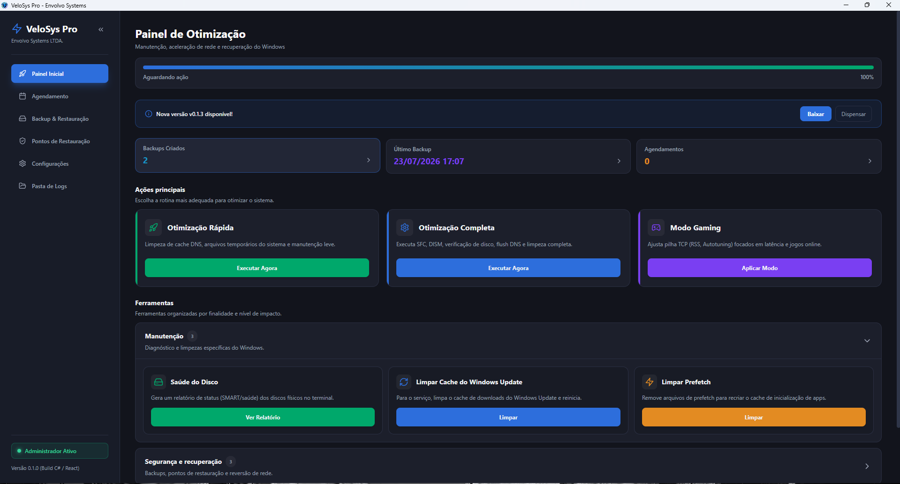
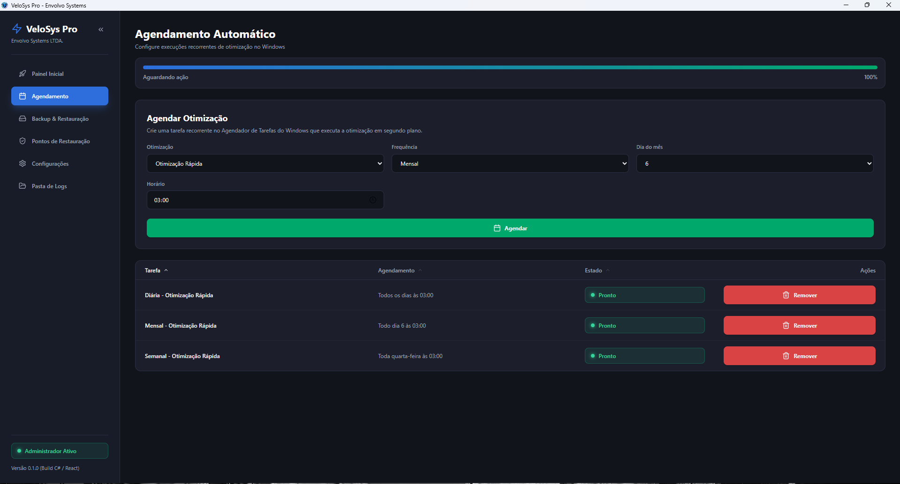
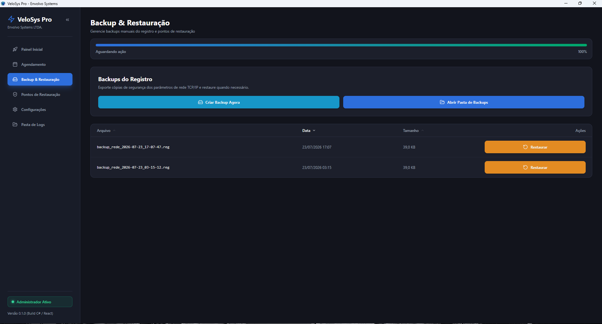
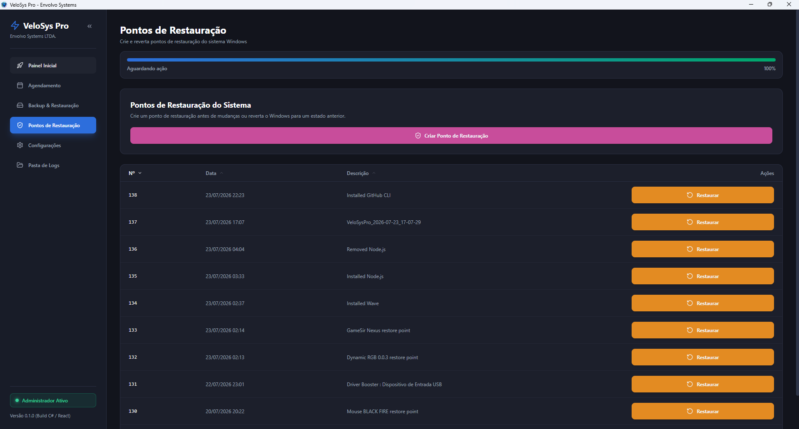
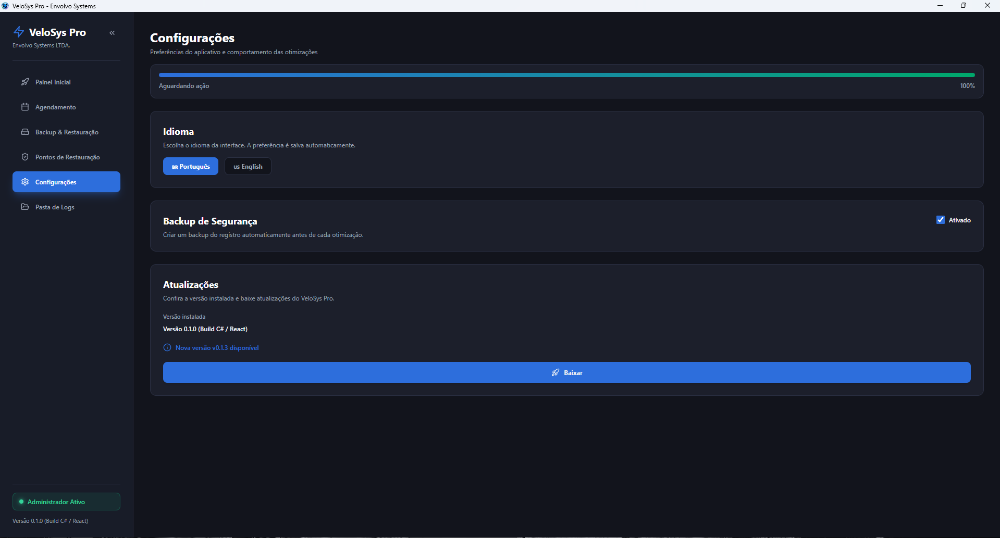
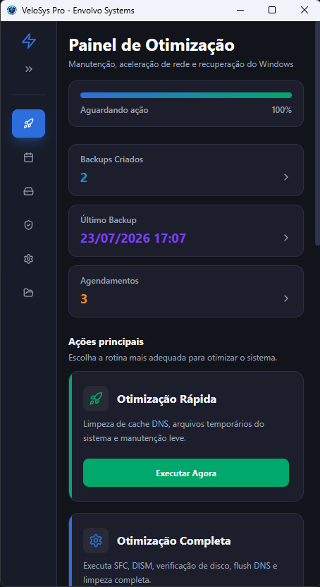

<p align="center">
  
</p>

<h1 align="center">⚡ VeloSys Pro</h1>

<p align="center">
  High-performance Windows optimization, network tuning, and registry-backup desktop app by
  <b>Envolvo Systems LTDA.</b><br />
  A React 18 + TypeScript UI hosted in a .NET 8 WPF / WebView2 shell, shipped as a single
  self-contained executable.
</p>

<p align="center">
  <a href="LICENSE"></a>
  
  
  <a href="https://chrystiamjr.github.io/VeloSysPro/"></a>
</p>

---

## 📌 Features

- 🚀 **Quick / Full Optimization**: DNS flush, temp cleanup, `sfc /scannow`, DISM image repair.
- 🎮 **Gaming Mode / Revert Defaults**: tunes the TCP stack (RSS, Autotuning) or resets IP & Winsock.
- 🧹 **Maintenance tools**: clear the Windows Update cache, clean Prefetch, and a physical-disk (SMART) health report.
- 💾 **Registry Backup & Restore**: exports/imports TCP/IP `.reg` backups with confirmation.
- 🛡️ **System Restore Points**: list, create, and roll back Windows restore points.
- 📅 **Scheduling**: recurring optimizations via the Windows Task Scheduler, running the exe headlessly (`--task=<quick|full|gaming|revert>`).
- ⚙️ **Settings**: persistent language and safety-backup preferences (`%LOCALAPPDATA%\VeloSysPro\settings.json`).
- 🔔 **Update check**: notifies when a newer GitHub release is available.
- 🌐 **Bilingual (Rosetta)**: instant PT-BR 🇧🇷 / EN-US 🇺🇸 switching — including host log/status messages.
- 🎨 **Modern dark UI**: React 18 + TypeScript + TailwindCSS tokens, Atomic Design, a collapsible sidebar, and a progressive-disclosure dashboard with a concurrency-safe action lock.

---

## 📸 Screenshots

<table>
  <tr>
    <td width="50%"></td>
    <td width="50%"></td>
  </tr>
  <tr>
    <td align="center"><b>Dashboard</b> — progressive-disclosure actions + live console</td>
    <td align="center"><b>Scheduling</b> — recurring optimizations via Task Scheduler</td>
  </tr>
  <tr>
    <td></td>
    <td></td>
  </tr>
  <tr>
    <td align="center"><b>Backup &amp; Restore</b></td>
    <td align="center"><b>System Restore Points</b></td>
  </tr>
  <tr>
    <td></td>
    <td></td>
  </tr>
  <tr>
    <td align="center"><b>Settings</b> — persistent language &amp; safety-backup toggle</td>
    <td align="center"><b>Collapsed sidebar</b> — responsive layout</td>
  </tr>
</table>

---

## 🏗️ Architecture

```
VeloSysPro/
├── AGENTS.md / README.md / CHANGELOG.md / LICENSE
├── .editorconfig / .gitignore / global.json      # tooling + .NET 8 SDK pin
├── package.json / vite.config.js / tsconfig.json  # React 18 + Vite + Tailwind
├── .releaserc.json / commitlint.config.cjs        # semantic-release + Conventional Commits
├── src/
│   ├── domain/            # types + Rosetta i18n (nested pt_BR.json / en_US.json)
│   ├── infrastructure/    # typed WebView2 IPC bridge (bridge.ts)
│   └── components/        # Atomic Design: atoms, molecules, organisms, templates, pages
├── tests/                 # Vitest (unit) + Cypress (e2e)
├── desktop/               # C# .NET 8 WPF host (Edge Chromium WebView2)
│   ├── App.xaml(.cs)          # startup + headless CLI mode (--task=)
│   ├── MainWindow.xaml(.cs)   # WebView2 host, serves the embedded UI, IPC dispatch
│   ├── Optimizer.cs           # optimization orchestration (exit-code aware)
│   ├── CommandRunner.cs       # process execution + OEM-codepage output decoding
│   ├── BackupManager.cs / SchedulerManager.cs / SettingsManager.cs / UpdateChecker.cs
│   ├── IStatusSink.cs / FileStatusSink.cs / IpcHandler.cs / ManagedStream.cs
│   ├── NativeConsoleEncoding.cs
│   ├── app.manifest           # UAC Manifest (requireAdministrator)
│   └── VeloSysPro.csproj      # single-file publish, ui/ embedded as resources
├── desktop.Tests/         # xUnit (OEM decode)
├── installer/VeloSysPro.iss  # Inno Setup installer (bootstraps WebView2 Runtime)
├── scripts/               # setup-hooks.ps1, sync-version.mjs
├── .github/workflows/ci.yml  # PR validation + semantic-release
└── build.ps1              # 1-click build: Vite -> single exe -> installer
```

---

## 🚀 Getting Started

### For End Users

1. Download **`VeloSysPro-Setup-<version>.exe`** from the latest release and run it. The installer
   adds shortcuts and installs the Microsoft **WebView2 Runtime** automatically if it's missing
   (Windows 11 and recent Windows 10 already include it).
2. Launch **VeloSys Pro** and grant Administrator privileges when prompted by UAC (the optimizations require elevation).

> **SmartScreen note:** the app is not code-signed yet, so SmartScreen may show *"Windows protected
> your PC"* — click **More info → Run anyway**. A portable single `VeloSysPro.exe` is also attached to each release.

**Requirements:** Windows 10/11 (x64). No .NET install needed — the executable is self-contained.

### For Developers

```bash
git clone https://github.com/chrystiamjr/VeloSysPro.git
cd VeloSysPro
npm install
npm run setup-hooks   # installs the pre-commit (validate + build) and commit-msg (commitlint) hooks
```

- **Run the UI in a browser** (IPC mocked): `npm run dev` → http://localhost:5173
- **Validate**: `npm run validate` (type-check + Prettier + ESLint + Vitest)
- **Browser E2E**: `npm run cypress:run` (64 isolated scenarios using a typed WebView2 IPC harness)
- **Build the executable + installer**: `powershell -ExecutionPolicy Bypass -File .\build.ps1`
- **C# tests**: `dotnet test desktop.Tests/VeloSysPro.Tests.csproj` (native commands are replaced by in-memory fakes)

---

## 🔖 Versioning & Releases

Commits follow **[Conventional Commits](https://www.conventionalcommits.org/)** (enforced by commitlint).
On every push to `main`, CI runs **semantic-release**, which derives the next version, updates the
version everywhere (`scripts/sync-version.mjs`), builds the installer, updates `CHANGELOG.md`, and
commits the synchronized files back to `main` as `chore(release): <version> [skip ci]` before
publishing a GitHub Release with the installer attached. The release commit is explicitly ignored
by the commit analyzer and `[skip ci]` prevents a second workflow run. While pre-1.0, breaking
changes bump the **minor** version and features/fixes bump the **patch**.

The default-branch ruleset must allow the official **GitHub Actions** integration to bypass the
pull-request requirement; all other branch protections remain enforced. This exception is required
only for the release job's automated version commit.
