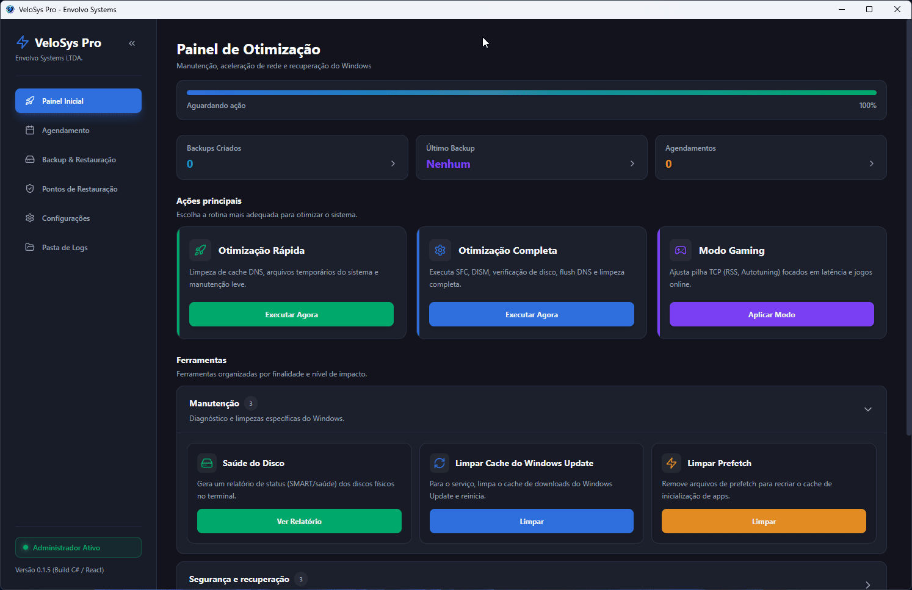

<p align="center">
  
</p>

<h1 align="center">VeloSys Pro</h1>

<p align="center">
  High-performance Windows optimization, network tuning, and registry-backup desktop app by
  <b>Envolvo Systems LTDA.</b><br />
  A React 18 + TypeScript UI hosted in a .NET 8 WPF / WebView2 shell, shipped as a single
  self-contained executable.
</p>

<p align="center">
  <a href="LICENSE"></a>
  
  
  <a href="https://chrystiamjr.github.io/VeloSysPro/"></a>
</p>

---

## 📌 Features

- 🚀 **Quick / Full Optimization**: DNS flush, temp cleanup, `sfc /scannow`, DISM image repair.
- 🎮 **À-la-carte optimizations**: an individually selectable, individually **reversible** catalog of
  processor, graphics, network, power, boot, and service Tweaks, applied behind a Safety Checkpoint
  and measured before and after. **Revert Defaults** still resets IP & Winsock.
- 🧹 **Maintenance tools**: clear the Windows Update cache, clean Prefetch, and a physical-disk (SMART) health report.
- 💾 **Registry Backup & Restore**: exports/imports TCP/IP `.reg` backups with confirmation.
- 🛡️ **System Restore Points**: list, create, and roll back Windows restore points.
- 📅 **Scheduling**: recurring optimizations via the Windows Task Scheduler, running the exe headlessly (`--task=<quick|full|gaming|revert>`).
- ⚙️ **Settings**: persistent language and safety-backup preferences (`%LOCALAPPDATA%\VeloSysPro\settings.json`).
- 🔔 **Update check**: notifies when a newer GitHub release is available.
- 🌐 **Bilingual (Rosetta)**: instant PT-BR 🇧🇷 / EN-US 🇺🇸 switching — including host log/status messages.
- 🎨 **Modern dark UI**: React 18 + TypeScript + TailwindCSS tokens, Atomic Design, a collapsible sidebar, and a progressive-disclosure dashboard with a concurrency-safe action lock.

---

## 🎬 Application Preview

<p align="center">
  
</p>

---

## 🏗️ Architecture

VeloSys Pro is split into a React frontend and an elevated .NET 8 WPF desktop host. The frontend
sends validated Actions through the WebView2 IPC boundary; the host routes them to domain-focused
optimization, recovery, scheduling, settings, and update services, then publishes typed Events back
to the UI. During packaging, the Vite bundle is embedded into the self-contained Windows executable.

Read the complete design, runtime flows, ownership boundaries, and safety invariants in
[`ARCHITECTURE.md`](ARCHITECTURE.md).

---

## 🚀 Getting Started

### For End Users

1. Download **`VeloSysPro-Setup-<version>.exe`** from the latest release and run it. The installer
   adds shortcuts and installs the Microsoft **WebView2 Runtime** automatically if it's missing
   (Windows 11 and recent Windows 10 already include it).
2. Launch **VeloSys Pro** and grant Administrator privileges when prompted by UAC (the optimizations require elevation).

> **SmartScreen note:** the app is not code-signed yet, so SmartScreen may show *"Windows protected
> your PC"* — click **More info → Run anyway**. A portable single `VeloSysPro.exe` is also attached to each release.

**Requirements:** Windows 10/11 (x64). No .NET install needed — the executable is self-contained.

### For Developers

```bash
git clone https://github.com/chrystiamjr/VeloSysPro.git
cd VeloSysPro
npm install
npm run setup-hooks   # installs the pre-commit (validate + build) and commit-msg (commitlint) hooks
```

- **Run the UI in a browser** (IPC mocked): `npm run dev` → http://localhost:5173
- **Validate frontend**: `npm run validate` (type-check + Prettier + ESLint + Vitest)
- **Browser E2E**: `npm run cypress:run` (isolated scenarios using a typed WebView2 IPC harness)
- **C# Unit & Native Integration Tests**: `dotnet test desktop.Tests/VeloSysPro.Tests.csproj -c Release`
  - Unit tests only: `dotnet test desktop.Tests/ -c Release --filter "Category!=Integration"`
  - Live native OS integration tests: `dotnet test desktop.Tests/ -c Release --filter "Category=Integration"`
- **Windows Sandbox Automated VM Test**: `powershell -ExecutionPolicy Bypass -File ./scripts/test-sandbox.ps1` (zero host pollution)
- **Build the executable + installer**: `powershell -ExecutionPolicy Bypass -File .\build.ps1`
- **Build documentation site**: `npm run build:docs`

### CLI Usage

```powershell
# Check version or print usage headlessly
./desktop/bin/Release/standalone/VeloSysPro.exe --version
./desktop/bin/Release/standalone/VeloSysPro.exe --help

# Execute scheduled optimization plans or presets headlessly
./desktop/bin/Release/standalone/VeloSysPro.exe --task=quick
./desktop/bin/Release/standalone/VeloSysPro.exe --task=full
./desktop/bin/Release/standalone/VeloSysPro.exe --task=gaming
./desktop/bin/Release/standalone/VeloSysPro.exe --task=revert
```

---

## 🔖 Versioning & Releases

Commits follow **[Conventional Commits](https://www.conventionalcommits.org/)** (enforced by commitlint).
On every push to `main`, CI runs **semantic-release**, which derives the next version, updates the
version everywhere (`scripts/sync-version.mjs`), builds the installer, updates `CHANGELOG.md`, and
commits the synchronized files back to `main` as `chore(release): <version> [skip ci]` before
publishing a GitHub Release with the installer attached. The release commit is explicitly ignored
by the commit analyzer and `[skip ci]` prevents a second workflow run. While pre-1.0, breaking
changes bump the **minor** version and features/fixes bump the **patch**.

The default-branch ruleset must allow the official **GitHub Actions** integration to bypass the
pull-request requirement; all other branch protections remain enforced. This exception is required
only for the release job's automated version commit.
